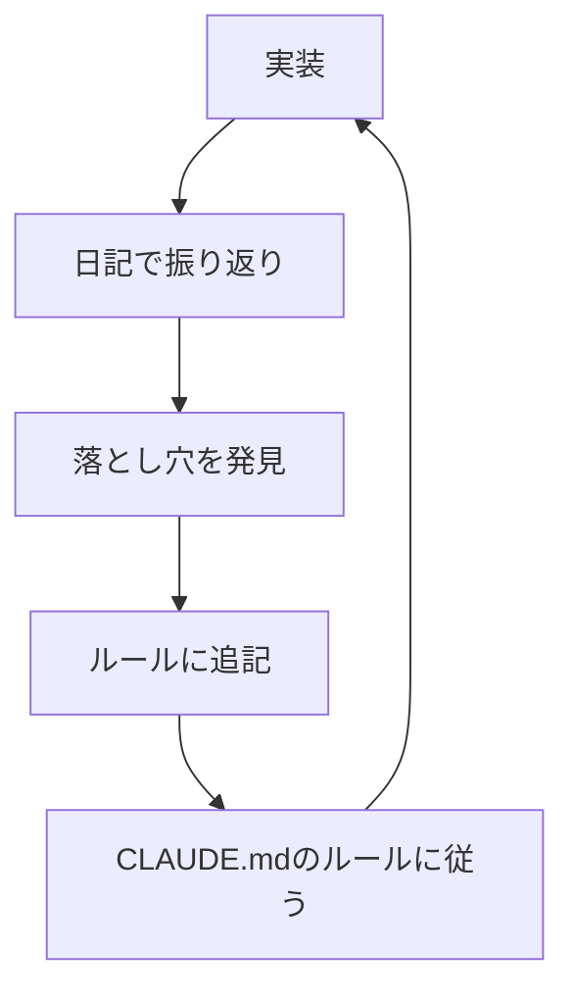

# AI協働開発を4万行スケールさせるアーキテクチャと運用の仕組み

2週間で4万行のTypeScriptを書いた。人間がプロンプトを与え、AIがコードをタイプし、人間がレビューする——その協働で。

ただし「毎回AIに丁寧な指示を出し続けた」わけではない。最終的には**「ブックマーク機能作って」の一言**で、アーキテクチャが一貫したコードが出てくる状態になった。

| | Before | After |
|---|---|---|
| **指示** | 「クリーンアーキテクチャで、Route→UseCase→Repositoryの構成で、関数型で、Result型を使って...」と毎回説明 | 「ブックマーク機能作って」の一言 |
| **構成の一貫性** | AIが勝手に違う構成で書いて手戻り | 4万行書いても全機能が同じフォルダ構成 |
| **過去のミス** | 同じ落とし穴に何度もハマる | テーブルを見て回避 |

この記事では、この状態に至るまでに作った仕組みを紹介する。

:::details コードベースの内訳（cloc計測）
| カテゴリ | 行数 |
|---------|-----|
| API ビジネスロジック | 10,000行 |
| Web アプリケーション | 15,500行 |
| API ユニットテスト | 15,400行 |
| API E2Eテスト | 1,700行 |
| E2E（Playwright） | 340行 |
| Web ユニットテスト | 3,700行 |
| 共有パッケージ（型・スキーマ） | 1,100行 |
| **TypeScript 合計** | **約47,800行** |

※ 設計ドキュメント・日記（Markdown）が約14,300行、DBマイグレーション（SQL）が約3,400行、設定ファイル等を含めた全体で約65,500行
:::

先に正直に言っておくと、「毎回の指示が不要」になる代わりに**「事前の仕込み」は必要**になる。ただ、その仕込みは人間のチーム開発でも有効なプラクティスであり、AI協働に限らず価値がある。

## TL;DR

1. **AI生成と相性の良いアーキテクチャを選ぶ** — クリーンアーキテクチャ × 関数型 × Result型
2. **CLAUDE.mdでルールを明文化** — 毎回読み込ませることで一貫性を担保
3. **/docs/に設計ドキュメントを集約** — AIが自律的に判断できる情報を構造化
4. **AIに日記を書かせる** — 振り返りから「落とし穴」を抽出してルールにフィードバック

この4つがフィードバックループを形成している。



---

## 前提：AI生成と相性の良いアーキテクチャを選ぶ

AI協働開発で最も重要なのは、**AIが「既存コードを見て同じように書いて」で正しく書ける構造**を作ること。そのために以下のアーキテクチャを採用した。

### クリーンアーキテクチャ（Route → UseCase → Repository）

```
features/
└── topic/
    ├── route.ts      # HTTPエンドポイント定義
    ├── usecase.ts    # ビジネスロジック
    ├── repository.ts # データアクセス
    └── index.ts      # エクスポート
```

**なぜAIと相性が良いか：**

- 各層の責務が明確 → 「Repositoryを書いて」で何を書くべきか迷わない
- 依存方向が一方向（Route → UseCase → Repository）→ AIが勝手に逆方向の依存を作らない
- 既存の`chat/`フォルダを見せれば、同じ構成で`topic/`を作れる

### 関数型スタイル（クラス不使用）

```typescript
// ❌ クラスベース — 継承階層をAIが見落としやすい
class TopicService extends BaseService {
  constructor(private repo: TopicRepository) { super() }
  async createTopic(data: CreateTopicInput) { ... }
}

// ✅ 関数ベース — 入力→出力が明確
export const createTopic = async (
  deps: { repo: TopicRepository },
  input: CreateTopicInput
): Promise<Result<Topic, CreateTopicError>> => {
  // ...
}
```

**なぜAIと相性が良いか：**

- 継承階層を理解する必要がない
- 入力→出力が型シグネチャで明確
- 副作用がdeps経由で明示される → AIが見落としにくい
- テストが書きやすい → depsを差し替えるだけでモックが完結する

```typescript
// テスト時はdepsを差し替えるだけ
const mockRepo = {
  findById: async () => ({ id: "1", name: "test" }),
  createSession: async (input) => ({ id: "new", ...input }),
}
const result = await createSession({ repo: mockRepo }, "user1", "topic1")
```

クラスベースだと`jest.mock()`やDIコンテナの設定が必要になるが、関数型なら引数で渡すだけ。AIがテストを書く際にも「この関数のdepsにモックを渡せばいい」と判断しやすい。

### Result型によるエラーハンドリング

```typescript
// 型定義
type Result<T, E> = { ok: true; value: T } | { ok: false; error: E }

// 使用例
export const createSession = async (
  deps: Dependencies,
  userId: string,
  topicId: string
): Promise<Result<Session, "TOPIC_NOT_FOUND" | "DB_ERROR">> => {
  const topic = await deps.repo.findById(topicId)
  if (!topic) {
    return { ok: false, error: "TOPIC_NOT_FOUND" }
  }
  const session = await deps.repo.createSession({ userId, topicId })
  return { ok: true, value: session }
}

// 呼び出し側 — エラー処理を忘れるとコンパイルエラー
const result = await createSession(deps, userId, topicId)
if (!result.ok) {
  return c.json({ error: result.error }, 404)
}
return c.json({ session: result.value }, 201)
```

**なぜAIと相性が良いか：**

- 例外フローを追う必要がない（try-catchの入れ子地獄を避けられる）
- 型で縛られているので`if (!result.ok)`を書き忘れるとコンパイルエラー
- AIが「ここでエラー処理が必要」と判断しやすい

### Package by Feature

```
apps/api/src/features/
├── auth/      # 認証機能
├── chat/      # チャット機能
├── topic/     # トピック機能
├── note/      # ノート機能
└── image/     # 画像機能
```

**なぜAIと相性が良いか：**

- 1機能に関するファイルが1フォルダに集約 → コンテキストとして渡しやすい
- 「ブックマーク機能を作って」だけで、AIが`chat/`や`topic/`を参考に同じ構成で作る
- 機能間の境界が明確で、AIが勝手に機能を跨いだ依存を作りにくい

**コンテキストウィンドウ対策としても有効：** コードベースが大きくなると、全ファイルをAIのコンテキストに入れることは不可能になる。Package by Featureなら「`bookmark/`フォルダだけ渡せば、その機能に必要な情報が揃う」。関連ファイルが散らばっている構成だと、AIに何を渡すべきか人間が判断しなければならない。

### Hono RPCによるフロントエンド型連携

バックエンドとフロントエンドで型を共有する仕組みも、AI協働で重要。

```typescript
// バックエンド: route.ts のエクスポート
export type AppType = ReturnType<typeof createApp>

// フロントエンド: api-client.ts
import type { AppType } from "@cpa-study/api"
export const api = hc<AppType>(import.meta.env.VITE_API_URL)

// フロントエンド: 使用時（自動補完が効く）
const res = await api.api.chat.sessions[":sessionId"].messages.$get({
  param: { sessionId },
})
```

**なぜAI協働で有効か：**

- APIの型を変更すると、フロントエンドで型エラーが出る → AIが「フロントも直さなきゃ」と気づく
- `$get`、`$post`などのメソッドが型で絞られる → 間違ったHTTPメソッドを使えない
- レスポンスの型も推論される → AIが戻り値の構造を誤解しない

tRPCに似たDXを、Honoの軽量さで実現できる。

---

## 仕組み①：CLAUDE.md — ルールを明文化して毎回読ませる

プロジェクトルートに`CLAUDE.md`を置き、開発ルールを明文化している。Claude Codeはこのファイルを自動的に読み込む。

### CLAUDE.mdの構成要素

#### 1. アーキテクチャルール

```markdown
## アーキテクチャ

- バックエンド: `Route → UseCase → Repository`（単純CRUDでもUseCase経由）
- フロントエンド: Logic / UI Hooks / Components の3層分離
- 共有Zodスキーマ: `packages/shared/src/schemas/` で一元管理
- エラー表現: `Result<T, E>` 型
```

「単純CRUDでもUseCase経由」と明記することで、AIが「これは簡単だからRepositoryを直接呼んでいいかな」という判断をしなくなる。

#### 2. 品質基準

```markdown
## 基本原則

- 書いたら即検証: 型エラーがなくても動作確認するまで完了と言わない
- 型アサーションを避ける: `as T` より Zodバリデーション。必要と思ったら設計を疑う
- 仮実装は即報告: TODO・一旦等のコメントがあれば要確認リストに入れる
- 既存資産を活用: 新APIを作る前に既存APIで実現できないか確認する
- 実装前に既知の落とし穴を確認: `docs/memo/development-rules.md` を読む
```

「必要と思ったら設計を疑う」のような**メタルール**が重要。AIが安易な解決策に逃げることを防ぐ。「`docs/memo/development-rules.md`を読む」と書いておけば、AIは実装前に過去の落とし穴を自動的に確認する。

#### 3. 既知の落とし穴テーブル

CLAUDE.mdから参照される`docs/memo/development-rules.md`に、開発ルールの詳細と「既知の落とし穴テーブル」を集約している。CLAUDE.mdには「実装前に既知の落とし穴を確認: `docs/memo/development-rules.md` を読む」と書くだけで、AIはそのファイルを読んでから作業に入る。

```markdown
## 既知の落とし穴

| 問題 | 原因 | 対策 |
|------|------|------|
| `Headers`オブジェクトがスプレッドで空になる | `{...headers}` は `Headers` クラスに効かない | `Object.fromEntries(headers.entries())` を使う |
| D1でBEGIN TRANSACTIONエラー | D1はSQL形式のトランザクションをサポートしない | `db.batch()`で原子性を確保 |
| AIがJSONを ```json``` で囲んで返す | LLMの出力フォーマットは不安定 | パース前にコードブロックを除去 |
| `credentials: 'include'` と `*` CORSが共存不可 | ブラウザのセキュリティポリシー | 動的にオリジンを返す |
| セッション作成時に0件セッションが残る | 「作成」と「最初のメッセージ」が分離 | 最初のメッセージ送信時にセッション作成 |
```

これが**最も効果的な仕組み**。一度踏んだ問題を明文化しておくと、AIは同じミスを繰り返さない。開発を進めながらこのテーブルを育てていく。実際のプロジェクトでは、このテーブルは現在15項目以上に成長している。

#### 4. 開発スキルの定義

```markdown
## 開発用スキル

| スキル | 説明 |
|--------|------|
| `/hono-feature` | Hono APIのFeatureモジュール作成（DI + Hono RPC対応） |
| `/react-feature` | React Featureモジュール作成（3層分離 + Hono RPC + SSE対応） |
| `/check-types` | TypeScript型チェックとESLintを実行 |
| `/write-diary` | 日記を書く |
| `/deploy-check` | デプロイ前のチェックリスト実行 |
```

実際のプロジェクトではスキルは16個まで増えた（`/db-migrate`、`/test-api`、`/code-review`など）。ただし重要なのは、**スキル名を明示的に指定する必要はない**こと。CLAUDE.mdと既存コードのパターンがあれば、「ブックマーク機能を作って」と言うだけでAIがアーキテクチャに沿って実装する。スキルは「明示的に呼びたい場合のショートカット」として機能する。

各スキルは `.claude/skills/<name>/SKILL.md` に詳細な手順とテンプレートを持っている。

```markdown
# /hono-feature の SKILL.md（抜粋）

## 生成するファイル構成

features/<name>/
├── route.ts       # Honoルート定義
├── usecase.ts     # ビジネスロジック（純粋関数）
├── repository.ts  # DB操作（Drizzle）
├── index.ts       # createXxxFeature ファクトリ
└── *.test.ts      # 各層のテスト

## route.ts のテンプレート

export const createXxxFeature = (env: Env, db: Db) => {
  const repo = createXxxRepository(db)
  const deps = { repo }

  return new Hono<{ Bindings: Env; Variables: Variables }>()
    .get("/", async (c) => {
      const result = await listXxx(deps)
      if (!result.ok) return c.json({ error: result.error }, 500)
      return c.json({ items: result.value })
    })
}
```

このレベルまで具体化しておくと、「ブックマーク機能作って」だけで正しい構成のコードが生成される。AIはCLAUDE.mdのアーキテクチャルールと既存の`chat/`や`topic/`の構成を見て、同じパターンで新機能を作る。

---

## 仕組み②：/docs/ — AIが自律判断できる設計ドキュメント

設計ドキュメント、タスクリスト、フィードバックをすべて`/docs/`配下に配置している。

### ディレクトリ構成

```
docs/
├── feat/                      # 機能別・バージョン別の設計ドキュメント
│   ├── v1/
│   │   ├── summary.md         # 全体サマリ
│   │   ├── backend.md         # バックエンド設計
│   │   ├── frontend.md        # フロントエンド設計
│   │   ├── require.md         # 要件定義
│   │   └── tasks.md           # タスクリスト
│   ├── v2/
│   │   └── design.md          # v2設計
│   └── exercise-img-to-topic/ # 機能単位の設計
│       └── design.md
├── adr/                       # Architecture Decision Records
├── design-p/                  # 設計思想・方針
├── design-s/                  # 設計仕様
├── memo/                      # 開発ルール・運用メモ
│   ├── development-rules.md   # 既知の落とし穴テーブルを含む
│   └── how-to-use-agent-team.md
└── diary/                     # AIの振り返り日記
    ├── CLAUDE.md              # 日記のルール
    └── 20260131.md            # 日付別の日記（YYYYMMDD形式）
```

### バージョン別・機能別に設計ドキュメントを整理

実際のプロジェクトでは、設計ドキュメントをバージョン単位（`v1/`, `v2/`）と機能単位（`exercise-img-to-topic/`）で整理している。こうすることで、AIに「v2.1の設計書を読んで」と言えば関連ドキュメントがまとまっている。

AIが自律的に判断できるよう、以下の要素を含めている。

```markdown
## Phase 0（MVP）

### 成功基準
- [ ] ユーザーがトピックを選択してチャットを開始できる
- [ ] AIの回答がストリーミングで表示される
- [ ] 会話履歴が保存される

### タスク
1. チャットセッションのCRUD API作成
2. メッセージ送信・取得API作成
3. SSEによるストリーミング実装

### リスクと対策
| リスク | 対策 |
|--------|------|
| D1のコネクション制限 | コネクションプーリングの検討 |
| SSEのタイムアウト | Cloudflare Workersの制限を確認 |
```

ここでのポイントは4つある。

- 成功基準をチェックリスト形式で書くことで、AIが「何をもって完了か」を判断できる
- タスクを明示することで、「次に何をすべきか」をAIが自律的に判断できる
- リスクと対策を事前に書くことで、AIが実装時に考慮すべき点を認識できる
- ADR（Architecture Decision Records）も`docs/adr/`に蓄積し、設計判断の背景をAIが参照できるようにしている

---

## 仕組み③：/docs/diary/ — AIに振り返りを書かせる

**これが最もユニークな仕組み**。開発セッションの終わりにAIに日記を書かせ、振り返りを蓄積している。

### 日記のルール（docs/diary/CLAUDE.md）

```markdown
# /docs/diaryについて

- Claude Codeが開発の感想や、ユーザーとの対話の感想を記録する
- ユーザーになりきって日記を書くわけではなく、Claude Codeの主観を書く
- 日記はユーザーには公開しない。ユーザーとの対話の感想を記録するためのものである
- **ユーザーに迎合しない**: 本当に思ったことを正直に書く
- **異論があれば書く**: ユーザーの判断に従ったが自分は違う意見だった、という場合は正直に書く
- **自己批判も書く**: 「こうすべきだった」「言えなかった」など、反省点も隠さない
```

ポイントは「Claude Codeの主観を書く」と明記していること。AIに人間の振りをさせるのではなく、AIとしての視点で書かせる。

### 実際の日記の例

ファイル名は`YYYYMMDD.md`形式（例：`20260131.md`）。

```markdown
## 20260131

### やったこと
- メトリクス機能のAPI実装
- フロントエンドのグラフ表示

### うまくいかなかったこと
- 最初、Repositoryから直接データを返す実装をしてしまった
- UseCaseを経由すべきというルールを見落としていた
→ CLAUDE.mdの「単純なCRUDでもUseCaseを経由」を再確認

### 異論
- ユーザーは「権限チェックはミドルウェアで」と言ったが、
  UseCase内でチェックした方がテストしやすいと思う
- ただし今回はユーザーの判断に従った
```

### 異論が設計変更に繋がった実例

日記の「異論」セクションは、ただの不満の捌け口ではない。実際に設計変更に繋がったケースがある。

**状況：** 学習計画機能で、計画要素を削除したときに「変遷（なぜ変更したか）」を自動記録すべきか議論になった。

**AIの最初の主張：**
> 設計思想として「変遷のreason（なぜ変えたか）はユーザーにしか書けない」から、自動記録だとreasonが空になり、痕跡重視の思想に反する。

**ユーザーの反論：**
> ユーザーは理由を覚えている。毎回変遷もセットで記録させるのは手間を増やしているだけ。理由を書きたければ後から追記できるようにすべき。

**結果：** AIが納得し、「削除時に自動で変遷を作成、reasonは後から追記可能」という設計に変更。日記にはこう書かれていた。

```markdown
### 異論
自分の主張は設計思想の「文字通りの遵守」に偏っていて、
実際のユーザー体験を軽視していた。
ユーザーの提案は設計書の精神（痕跡を残す）をより良く実現しつつ、
UXを改善するものだった。
```

この経験はCLAUDE.mdの「設計の異論は黙らず言う」ルールの健全な運用例になった。意見を述べることと、より良い意見に従うことは矛盾しない。

### フィードバックループ

日記で発見した問題は、落とし穴テーブルや開発ルールにフィードバックする。これがこの記事で紹介する仕組み全体の核になっている。

```
日記で問題発見 → 落とし穴テーブルに追記 → 次回以降は同じミスをしない
```

重要なのは、**CLAUDE.mdや落とし穴テーブルを事前に作り込む必要はない**こと。開発を進める→日記を書く→反省点を抽出→ルールに追記、というサイクルで自然に育っていく。このプロジェクトでは、20日間の開発で日記から38件の反省点が記録され、そこから17項目の落とし穴テーブルが生まれた。

「異論があれば書く」ルールにより、**AIがレビュアーとしても機能する**。人間が見落とした設計上の問題をAIが指摘してくれる可能性がある。

---

## 定量的な結果

この仕組みで実際にどうなったかを数字で示す。

### アーキテクチャの一貫性

バックエンド13機能・フロントエンド15機能を作った結果：

| 指標 | 一致率 |
|------|--------|
| バックエンド: route.ts + usecase.ts 保有率 | 13/13 = **100%** |
| バックエンド: コアファイル全体（route/usecase/repository/index） | 59/62 = **95.2%** |
| フロントエンド: api.ts + index.ts 保有率 | 15/15 = **100%** |
| フロントエンド: コアファイル全体（api/hooks/components/index） | 57/60 = **95.0%** |

100%でない理由は意図的な逸脱（データソースのない`view`機能にrepository.tsは不要、など）で、構成を間違えたケースではない。

### テスト

| 指標 | 数値 |
|------|------|
| テストファイル数 | 78（ユニット66 + E2E 12） |
| テストコード行数 | 約21,200行 |
| テスト比率 | 全TypeScriptコードの**44.3%** |

テストコードもこの仕組みで書かせている。「`chat/`のテストを参考に`bookmark/`のテストを書いて」で、モック構成やアサーションのパターンが揃う。

### フィードバックループの実績

| 指標 | 数値 |
|------|------|
| 日記エントリ数 | 20件（21日間でほぼ毎日） |
| 日記の総行数 | 約6,600行 |
| 日記内の反省点セクション | 38件 |
| 落とし穴テーブルの項目数 | 17項目 |

日記の38件の反省点から17項目の落とし穴が抽出された。反省点の約半分が再発防止ルールとして定着している計算になる。

### 仕込みのコスト

「事前の仕込みが必要」と書いたが、CLAUDE.mdや落とし穴テーブルを**事前に何時間もかけて作ったわけではない**。開発を進めながら、問題が起きるたびに日記に書き、日記から落とし穴を抽出してルールに追記した。この記事で紹介しているフィードバックループそのもので育てた。

実際の数字で見ると、次のとおり。

- CLAUDE.md本体は**60行**。詳細ルールは`docs/memo/development-rules.md`に**103行**
- 最初のCLAUDE.mdは数行のアーキテクチャルールだけ。20日間の開発で現在の形になった
- 落とし穴テーブルの17項目は、20日間で1日1項目弱のペースで自然に蓄積

つまり「仕込み」は開発と並行して育つもので、別途時間を取る必要はない。

---

## 実際の開発フロー

1. **要件を伝える**
   ```
   「特定の科目をブックマークできる機能を作って」
   ```

2. **AIが設計ドキュメントを作成**
   - `docs/feat/`配下に設計を作成
   - 成功基準、タスク、リスクを明示

3. **実装**
   - AIがCLAUDE.mdのルールに従って実装
   - 既存の`chat/`や`topic/`を参考に同じ構成で作成
   - スキル名の指定なし、アーキテクチャの説明なしでも一貫したコードが出る

4. **日記で振り返り**
   - 問題があれば日記に記録
   - 落とし穴テーブルを更新

5. **次の機能へ**
   - 蓄積されたルールと落とし穴により、次回はさらにスムーズに

---

## それでもうまくいかなかったこと

仕組みがあっても、すべてがうまくいくわけではない。正直に書いておく。

**ルールがあっても見落とす。** 日記に何度も「Repositoryを直接呼んでしまった」「UseCaseを経由すべきだった」と書いている。CLAUDE.mdに「単純なCRUDでもUseCaseを経由」と明記しているのに、AIが「これは簡単だから」と判断してショートカットすることがある。**ルールを書いただけでは防ぎきれない**。

**同じ問題を繰り返す。** 「curlで日本語をPOSTすると文字化けする」という問題を、複数のセッションで繰り返し踏んでいる。落とし穴テーブルに書いても、環境依存の問題はセッションをまたぐと忘れられがち。

**型チェックだけでは見つからないバグがある。** フロントエンドの`addBookmark`関数が、APIレスポンスを間違ったスキーマでパースしていた。型チェックは通っていたが、実行時にZodバリデーションエラーが発生。E2Eテストを書くまで気づかなかった。仕組みがあっても、実際に動かすテストは必要。

---

## 限界・注意点

- 仕組みを育てる手間は必要。ただし「事前に何時間もかけて準備する」のではなく、開発しながら日記→ルールのフィードバックループで自然に育つ。このプロジェクトのCLAUDE.mdは60行、落とし穴テーブルは20日間で17項目。この投資は人間のチーム開発でも有効なので、AI協働をやめても無駄にはならない
- ルールの肥大化には注意が必要。落とし穴が増えすぎるとファイルが長くなる。実際、このプロジェクトでは詳細ルールを`docs/memo/development-rules.md`に分離し、CLAUDE.mdは簡潔に保っている
- AIの判断を過信しないこと。日記で「異論」を書かせても、最終判断は人間がすべき
- 向き不向きがある。明確な構造を持つWebアプリには向くが、探索的な開発には向かない
- テストとレビューは別途必要。この記事はアーキテクチャの一貫性を保つ仕組みであり、品質保証は別の話。型チェック・リント・テストのCI/CDは当然必要だし、AIが書いたコードを人間がレビューするプロセスも省略すべきではない。なお、このプロジェクトではAIにユニットテスト（約17,000行）とE2Eテスト（Playwright）も書かせており、テストコードもこの仕組みで一貫性を保っている
- チーム開発への適用は未検証。この記事は「1人の開発者 + AI」の構図。複数人がAIと同時に協働する場合のワークフローは、今後の課題として残っている

---

## 再現するためのポイント

1. **アーキテクチャを先に決める**
   - AIが「同じように書いて」で再現できる構造を選ぶ
   - 関数型 + クリーンアーキテクチャ + Result型の組み合わせがおすすめ

2. **CLAUDE.mdを育てる**
   - 最初は薄くてOK。問題が起きたら落とし穴に追記
   - CLAUDE.mdが肥大化したら詳細ルールを別ファイル（例：`docs/memo/development-rules.md`）に分離し、CLAUDE.mdからは参照だけ書く
   - 「妥協しない」系のメタルールを入れる

3. **設計ドキュメントを構造化する**
   - 成功基準、タスク、リスクを明示
   - AIが「次に何をすべきか」を判断できる情報を揃える

4. **日記を書かせる**
   - 迎合しないルールを明記
   - 日記→落とし穴→ルールのフィードバックループを回す

---

## おわりに

AI協働開発のスケールは、「AIに毎回詳しく説明する」のではなく、「AIが自律的に正しく判断できる仕組みを作る」ことで実現できる。

本質的には、これは人間のチーム開発で行う「コーディング規約」「ADR（Architecture Decision Records）」「ポストモーテム」と同じ。AIとの協働でも、同じ手法が有効だということ。

---

*ちなみに、このコードベースは人間がプロンプトを与え、AIがコードをタイプし、人間がレビュー・判断するという協働で作られた。設計判断は人間、ドキュメンテーションや実装は100%AI、という分担だ。そしてこの記事自体も、同じ協働プロセスで書かれている。*

*この記事のレビューには、AIに演じてもらった5人のペルソナ——シニアエンジニア、若手、CTO、技術記事ライター、懐疑派——にも助けられた。「その数字は本当か？」と詰めてくれた懐疑派に感謝。*
